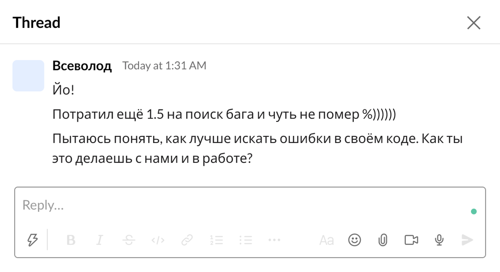
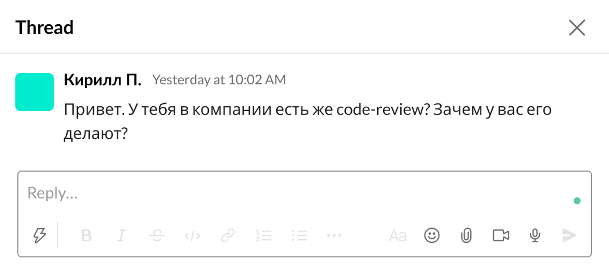
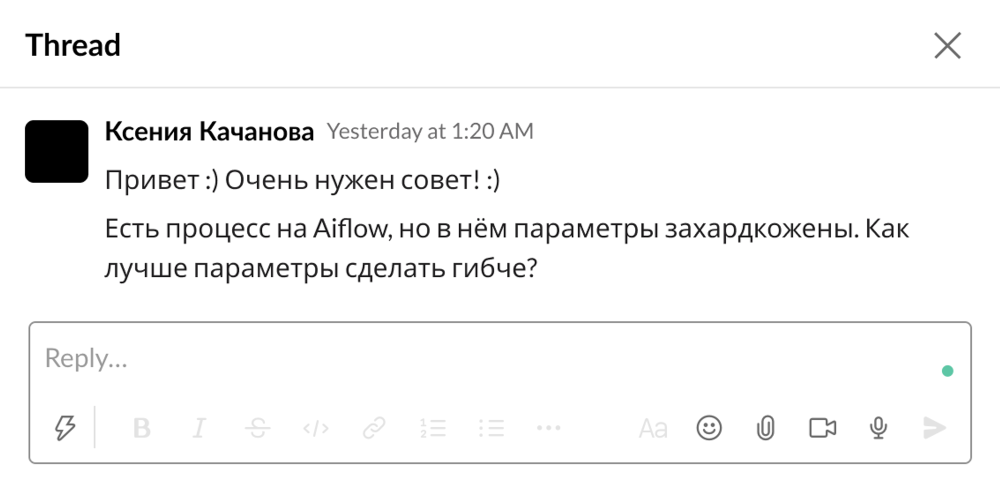
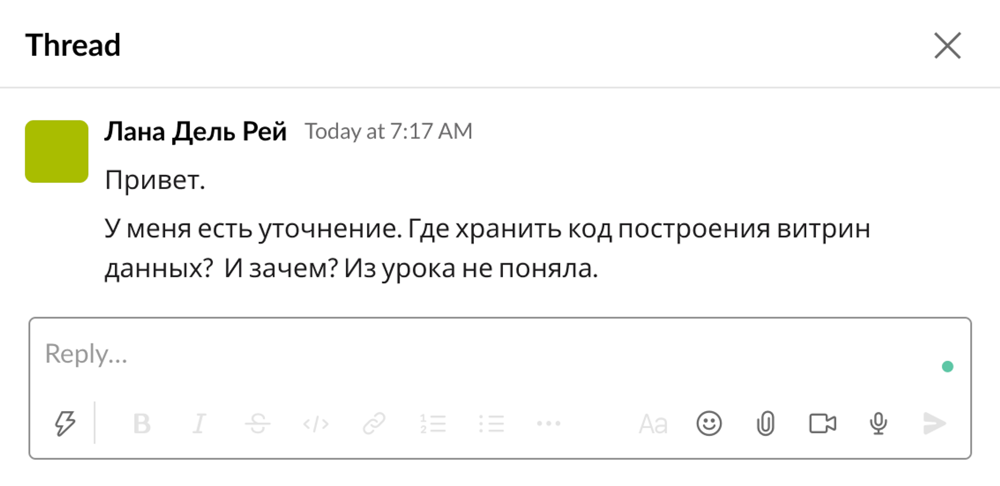

## Задание 2.1. Хард-скиллы наставника 
##### 1. Для чего нужны уровни изоляции в СУБД? Чем отличается serializable от snapshot? Какие уровни изоляции используются в DWH? Что такое constraints и как они используются в DWH?

Уровни изоляции разрешают проблему конкурентного доступа к данным, позволяют по-разному сохранять согласованность при одновременно выполняемых транзакциях.

Принято определять 4 уровня изоляции: 

Read uncommitted – феномен грязного чтения. \
Read committed - феномен неповторяющегося чтения, феномен чтения фантомов \
Repeatable read - феномен чтения фантомов \
Serializable 

Чем выше уровень изоляции, тем лучше согласованность данных, но медленнее скорость работы из-за блокировок.

Snapshot isolation не гарантирует сериализуемость. 

Constraints – это ограничения значений определенного атрибута. Например, уникальность, not null, внешний ключ. Также можно вводить свои ограничения.
Constraints гарантируют, что значения в определенном атрибуте будут соответствовать определенным правилам.

##### 2. Какие слои хранилища данных вы можете выделить? Может ли MongoDB являться одним из слоёв хранилища, и почему?

Слои DWH- это логическое разделение данных.

Стандартные слои: \
Stage – сырые данные \
DDS – детальный слой (Star/DV/Anchor) \
DM – слой с витринами данных

Еще отдельно иногда выделяют сервисный слой с метаданными для обслуживания ETL-процессов.

MongoDb  может быть, к примеру, операционным слоем хранилища. 
Например, когда на основе dds/dm выполняется reverse etl в MongoDb и бизнес-команды пользуются данными в операционном режиме.

##### 3. Как можно работать с большими данными и машинным обучением при использовании данных из DWH? И при чем тут Data Lake? 🙂

Иногда большие данные, например, неструктурированные, нерентабельно загружать в СУБД. \
В этом случае данные приземляются в DataLake, он может быть реализован в Hadoop и является частью DWH. \
Обрабатывают такие данные через специальный фреймворк. Как правило, Spark.

##### 4. Что такое UDF в Spark? Когда их хорошо использовать, а когда нет?

UDF - User Defined Functions. Функции, определяемые пользователем. Полезны когда не хватает функционала существующих функций. \
UDF приводит к снижению производительности. Особенно в pySpark. В Java/Scala таких проблем нет. \
UDF часто недетерминированные, необходимо внимательно смотреть на план выполнения.

##### 5. Представьте некоторое хранилище, в котором для оркестрации процессов используется Airflow. Как могут выглядеть самые популярные проблемы?

Не реализована идемпотентность дагов. \
Передавать большие данные между тасками через xcom \
Вставлять код на верхнем уровне- он вызывается при парсинге \
Неправильная работа с датой/временем

##### 6. Для чего нужен Spark Structured Streaming? Чем он отличается от Kafka? Приведите пример использования Kafka или Spark в рамках DWH некоторой компании, как они могут использоваться и зачем?

Spark Structured Streaming позволяет работать с потоковыми данными. Kafka является шиной данных, а Spark обработчиком.

Kafka в стеке DWH может отвечать за передачу данных в сырой слой. 
Например, CDC. Или от команд продуктовой разработки. 
Затем из топика батчами вставлять в СУБД (например, GreenPlum)

##### 7. Что такое Docker Swarm, для чего используется? Как он связан с Docker Compose и Kubernetes? Можно ли реализовать blue-green деплой на docker swarm + docker compose? Как сохранить данные между запусками разных контейнеров?

Docker Swarm — это платформа оркестровки контейнеров. Используется для построения отказоустойчивых, масштабируемых и с возможностью балансировки нагрузки сервисов.
Основана на кластере.

Docker Compose запускает вместе несколько контейнеров, а Docker Swarm может запустить несколько экземпляров контейнера на разных нодах своего кластера. 
Docker Swarm может использовать docker-compose.yaml для создания стека.

Kubernetes решает подобную задачу, что и Docker Swarm. Подходит для масштабных проектов.
Docker Swarm можно использовать для blue-green деплоя, добавив секции healthcheck, deploy

## Задание 2.2. Кейсы

<aside>
Представьте, что вы уже наставник на курсе Data Engineer. И после вебинара студенты задают вам вопрос в треде.

Напишите ответ так, как бы ответили в таком случае студенту(ке). 

Чтобы ответ был более полным, к каждому кейсу мы описали краткий контекст возникновения — что студенты уже изучили к этому моменту, а что изучают в тот момент, когда задали вопрос.

</aside>

---

**Кейс 1**

Спринт — актуально в любом, пусть "Выгрузка данных из внешних источников на Python"

Уже изучено — Python, работа с файлами, Pandas, работа с БД

> Всеволод, привет! ) \
В IDE, как правило, есть опция debug. Она позволяет просматривать состояние программы на определенной строке кода. \
В PyCharm, например, можно ставить брейкпоинты нажатием левой кнопки сышки на строке кода слева. \
Потом запускаешь дебаг и в местах брейкпоинтов можешь смотреть значения переменных. \
Попробуй. Будут вопросы- пиши

**Кейс 2**

Спринт — общий вопрос от студента

Уже изучено — Python

> Привет! Конечно. Это основа качественной командной работы. \
Суть в том, что ты можешь ошибиться/сделать неоптимально часть работы и вывести это в прод. \
А с помощью кодревью твой коллега, как правило, один из опытных ребят в команде, покажет тебе где и что не так. \
Одни плюсы- в прод идет качественный код, а ты растешь как профессионал за счет обратной связи от коллеги)

**Кейс 3**

Спринт — "ETL процессы, Airflow"

Уже изучено — Python, DAG, SQL

> Ксения, привет) \
А можешь конкретизировать о каких параметрах идет речь? \
Скинь, пожалуйста, код, в котором это отражено и вместе разберёмся)

**Кейс 4**

Спринт — "Витрины данных", студенты учились собирать витрины из данных в заданной модели DWH

Уже изучено — SQL, DWH, Git

Отметьте дополнительно, как применяется такой код, в частности, DDL и DML.

> Лана, привет.
Как правило, код хранится в репозитории. Например, github, gitlab. \
Делается это для того, чтобы была понятна история разработки. И код всегда можно было бы вернуть при неудачной выкатке в прод.

> Есть, например, интересный проект Liquibase, который как раз помогает качественно выкатывать код в прод. \
Но достаточно и обычного sql под git. 

> Важно писать идемпотентный код, который можно многократно запускать. \
Например, для DDL в контексте postgresql использовать конструкцию if exists. \
То есть для каждой таблички создаешь отдельный файл. \
И, например, если после создания накатываешь добавление атрибута, то пишешь так в этом файле\
alter table <table_name> add column if not exists <column_name> <type>; \
Потом этот код можно многократно идемпотентно прогонять.
